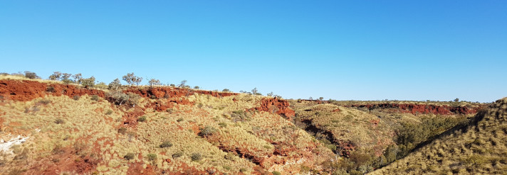

# gazp-toolbox

A repository to store R code, scripts and data from the [__Global Arid Zone Project__](https://drylandrestore.com). 

*** 

## Code folders

| name | mantainer | type | description | 
| :---: | :---: | :--- | :--- |
| [template](template) | You Name | describe type | describe what it does | 
| [taxon_name_check](taxon_name_check) | Gustavo Paterno | R functions | A protocol with multiple functions to check and standradize taxon names |

### Adding a code folder

* Include your data on the table above.
* Try to follow the template files. If it is not R code, try to include a example of usage.

*** 

## Datasets

| name | mantainer | type | description | 
| :---: | :---: | :--- | :--- |
| dataset name | You Name | describe type | describe variables | 

### Adding a dataset folder

* Include your data on the table above.
* to be developed....

***

### License

### Code of conduct
